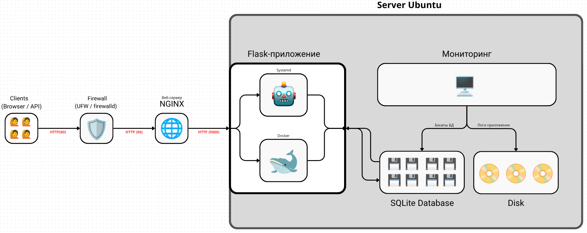

# Infrastructure Automation: Flask Web App

## Описание

Этот репозиторий содержит инфраструктурный код для автоматизированного развертывания веб-приложения на Flask с помощью Ansible. Поддерживается запуск через systemd или Docker Compose. Веб-прокси реализован на Nginx. Монитормнг и резервное копирование реализованы через Bash-скрипты и cron.

## Архитектурная схема



Подробная информация о схеме доступна в [документации по архитектуре](docs/architecture.md).

## Быстрый старт

1. Клонироватье репозиторий:
   ```bash
   git clone <этот_репозиторий>
   cd <папка_репозитория>
   ```
2. Подготовить виртуальную машину Ubuntu и создать пользователя `devops` с доступом по SSH-ключу.
3. Настроить firewall (ufw/firewalld) для открытия порта 80.
4. Запустить Vagrant для локального теста:
   ```bash
   vagrant up
   ```
5. Проверить доступность сервера:
   - Веб-приложение: http://localhost:8080
   - Nginx reverse proxy: http://test.local

6. Запустить Ansible playbook:
   ```bash
   ansible-playbook -i task1-infrastructure/inventory.ini task1-infrastructure/playbook.yml
   ```

## Структура репозитория

Полная структура репозитория описана в [документации по структуре](docs/repo_structure.md).

## Тестирование

Инструкции по тестированию доступны в [документации по тестированию](docs/testing.md).

## Дополнительная документация

- [Архитектура](docs/architecture.md)
- [Структура репозитория](docs/repo_structure.md)
- [Тестирование](docs/testing.md)

## Контакты

Для вопросов и предложений: <viktor.prilovsky@gmail.com>

---

